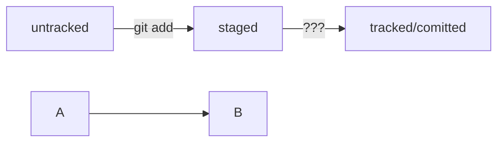

# Тестовый проект
1. **Начало**
2. _Общая часть_
____

3. __Конец__

Добавить раздел про HEAD, Дополнить инфу про git log

```mermaid
graph LR;
  untracked -- "git add" --> staged;
  staged    -- "???"     --> tracked/comitted;

%% стрелка без текста для примера: 
  A --> B;
``` 